

## WLED-Stiftebox

### Story

Diese Anleitung beschreibt die Montage einer WLED-Stiftebox. Das Stiftebox Gehäuse wird mit dem Lasercutter erstellt. Die Frontseite könnt ihr selbst designen, die Vorlage steht zum Download bereit. Anschließend verlöten wir den WLED-Stripe mit dem ESP8266. Die Inbetriebnahme erfolgt über install.wled.me.

### Die WLED-Stiftebox

### Hardware

Die Stückliste für die WLED-Stiftebox:

| Anzahl | Bezeichnung | 
| -------- | -------- | 
|  1 |  Sperrholz 300x600 x 3mm  |
|  1 | ESP8266  |
|  1 | WLED-Stripe WS2812B   |
|  1 |  USB-C Kabel mit Ladestecker  |
|  1 | Litze, Holzleim   |

### Aufbau und Montage

Der Aufbau und die Montage der WLED-Stiftebox ist in mehrere Schritte unterteilt.

#### Schritt 1: Die Frontansicht designen

Verwende die Inkscape Vorlage:

Inkscape Vorlage

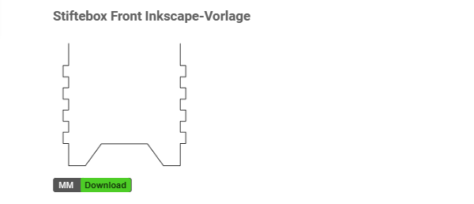

#### Schritt 2: Die Verbindungen löten

Löte die drei Litzen an den WLED-Stripe
ESP8266 > WLED
5V > 5V, (D4) GPIO2 > Din, GND > GND

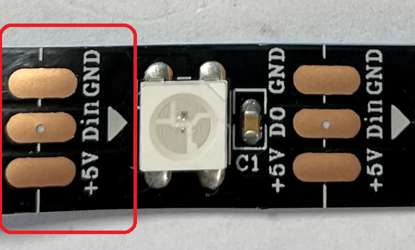

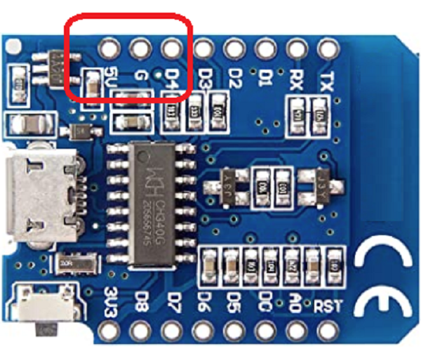

#### Schritt 3: Die WLED Inbetrieb nehmen
Schließe den ESP8266 an den Laptop an und öffne im Browser die Seite https://install.wled.me/.
Starte mit "Installieren"

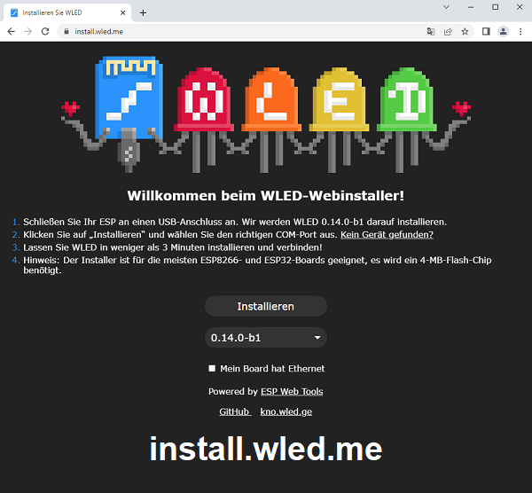

### Stelle die USB-Verbindung her

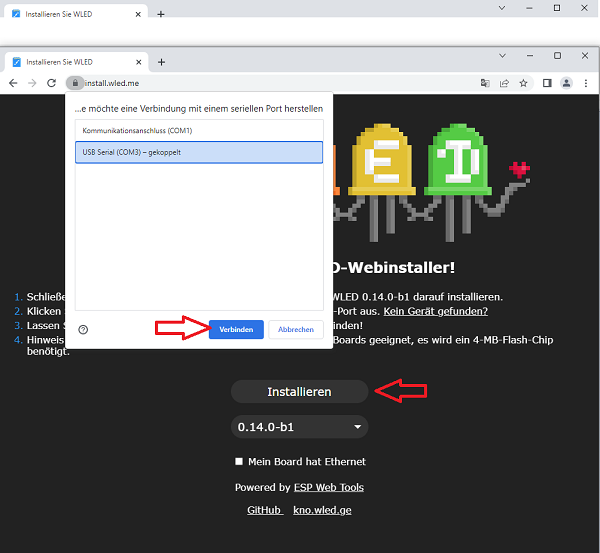

### Installiere die WLED

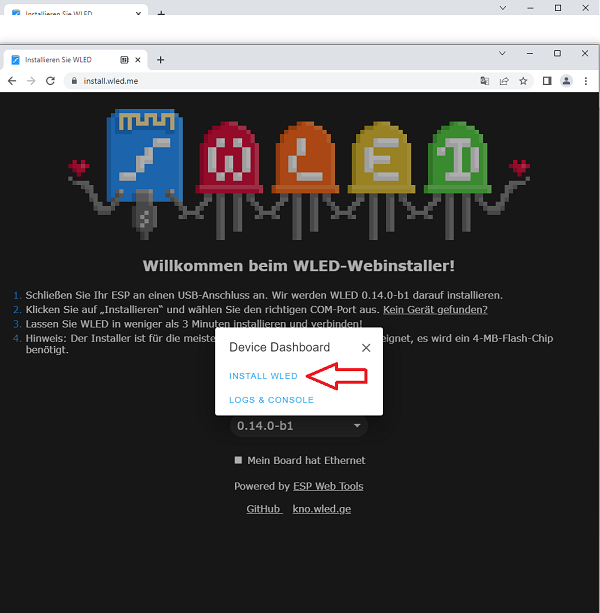

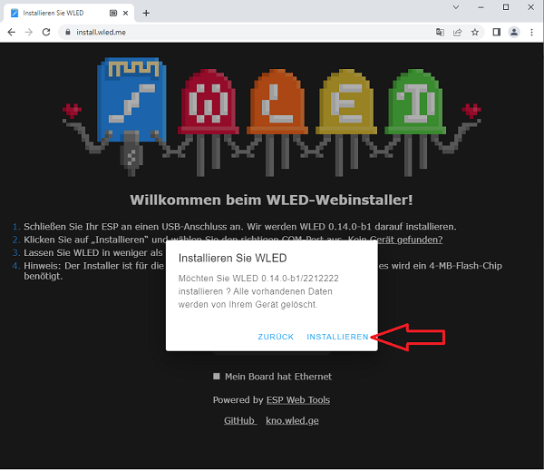

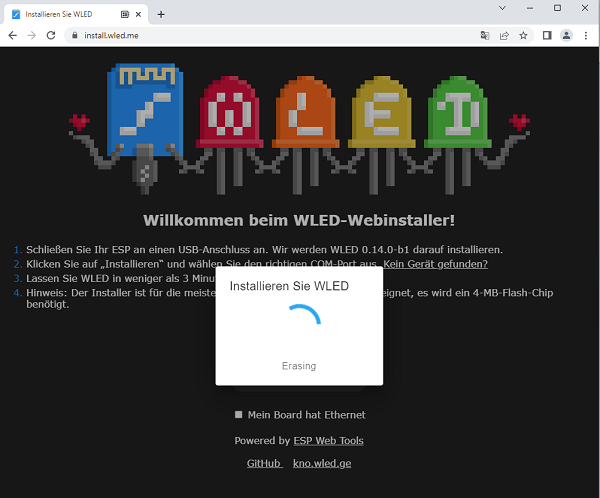

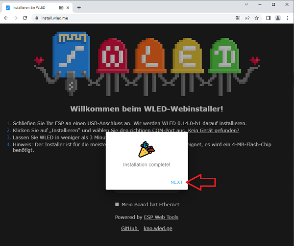

### Gib die WLAN Zugangsdaten ein

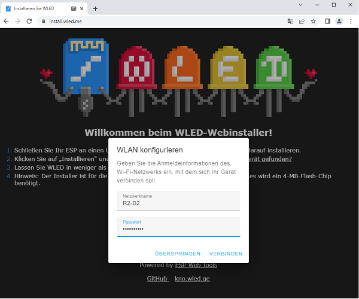

### Öffne die Verbindung zum ESP8266

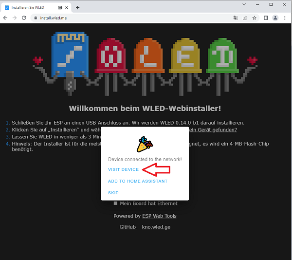

### Öffne die Konfigurations-Seite

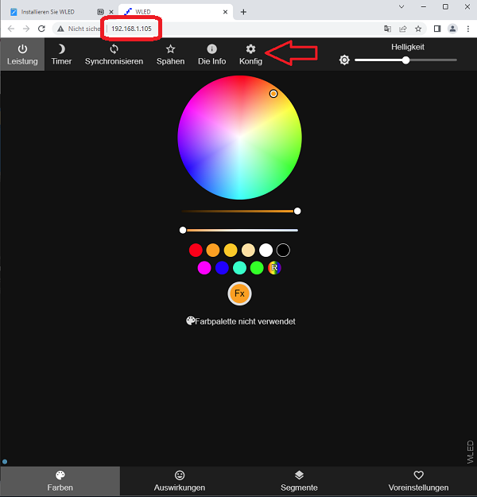

### Öffne die LED-Einstellungen

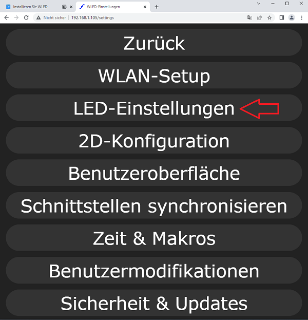

### Editiere die WLED-Einstellungen

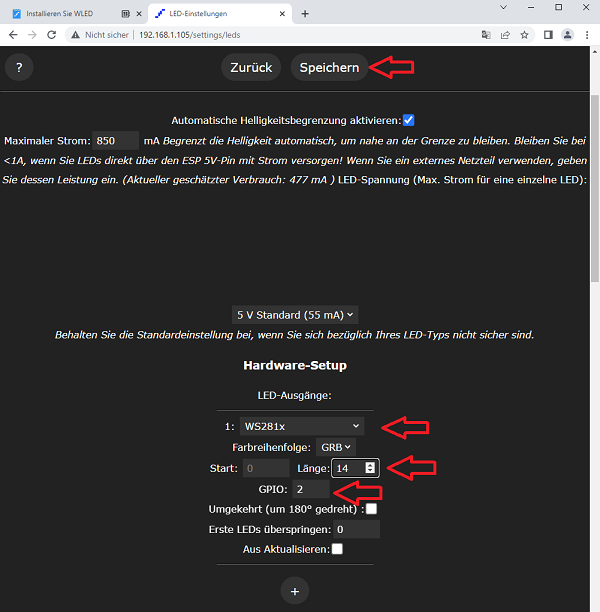

### Teste die Funktionen

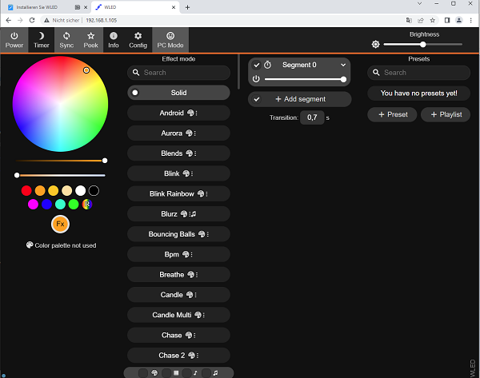

#### Schritt 4: Die Stiftebox montieren
Nach dem Funktionstest und dem designen der Frontansicht wird die Stiftebox ausgelasert und montiert.
Montiere den ESP8266 in die Stiftebox und führe die Kabel durch die Boden-Öffnung.
Klebe den WLED-Stripe auf die Unterseite der Stiftebox.

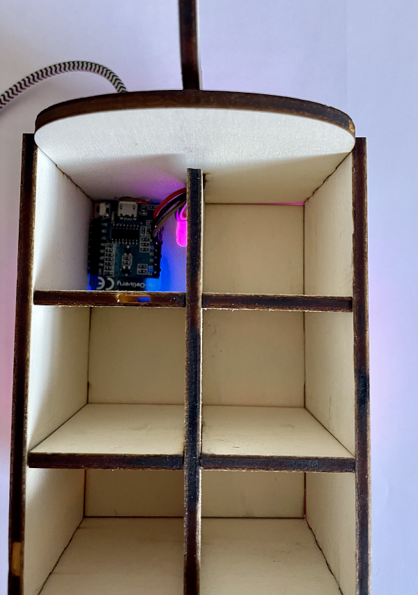

#### Schritt 5: Spannung anschließen
Nach der Montage und dem Funktionstest wird der ESP8266 über ein USB-C Kabel und einem Steckernetzteil oder einem Akkupack mit Spannung versorgt.

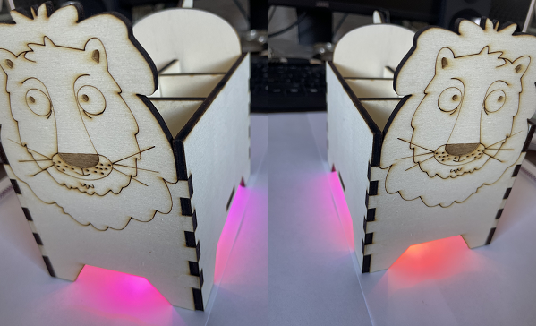

Die WLED-Stiftebox

Nach der Installation ist die WLED-Stiftebox mit dem Handy/Tabled/PC steuerbar.
Im WiFi setup kann eine feste mDNS Adresse gespeichert werden, z.B. mywled.local.

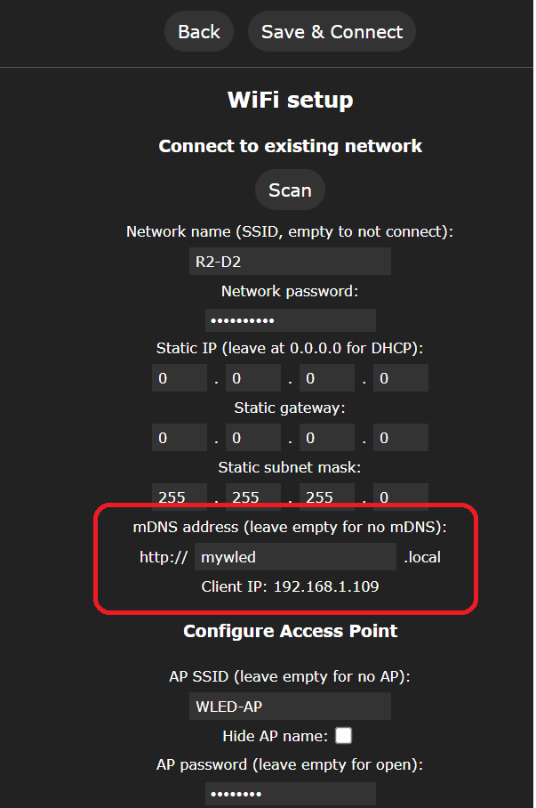

Aufruf der WLED-Steuerseite mit: mywled.local

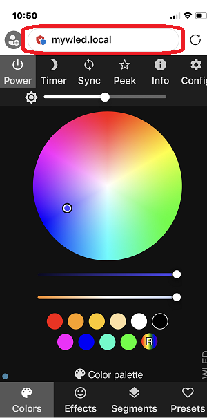

Alternativ zur WLED-Stiftebox könnt ihr auch eine WLED-Lampe bauen

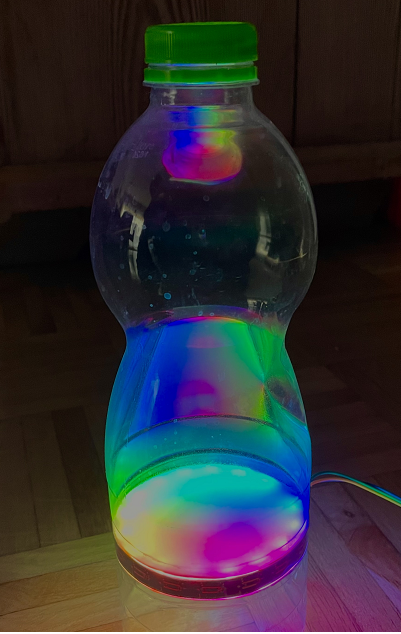

Fertig!

---

   
<ol class="breadcrumb" style="border-top: 2px solid black;border-bottom:2px solid black; height: 45px; width: 900px;"> 
<a href="#oben">nach oben</a>
</ol>

  

---
